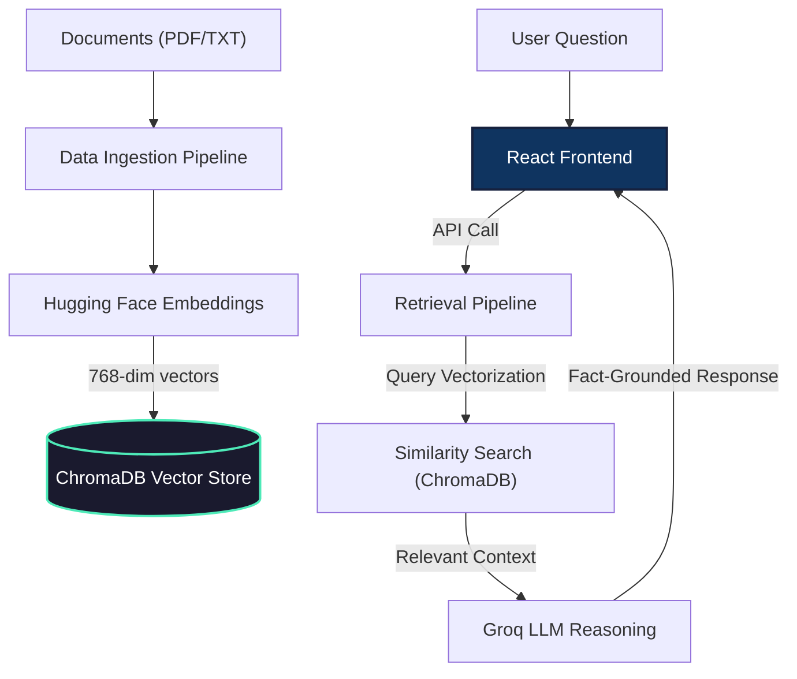

# Curator AI | Neural Knowledge Engine

A high-performance, completely serverless-friendly **Retrieval-Augmented Generation (RAG)** platform. This project combines a modern **React (Vite)** interface with an ultra-lightweight **FastAPI** reasoning engine, powered by the **Groq API** and natively integrated **ChromaDB** for long-term AI memory. 

By utilizing blazing-fast Groq LPU inference and a strictly localized native Python vector store, the backend boasts an incredibly lightweight infrastructure, making it perfectly optimized for free-tier cloud hostings like Render, Vercel, and Railway without needing heavy Docker containers.

Demo:- [Live](https://curator-ai-tau.vercel.app/)

---

## Key Features

### 1. Multi-Chat Reasoning System
Manage multiple independent AI research sessions simultaneously. 
- **In Sidebar**: Switch between conversations, rename, or delete chats.
- **Persistent Memory**: Your chat history is saved locally in your browser so you never lose context.
- **Glassmorphism UI**: A premium, dark-mode design built with Tailwind CSS and smooth animations.

### 2. Intelligent Knowledge Vault (Pipelines)
Upload, index, and query your private documents instantaneously (Supports `.txt` and `.pdf`).
- **Lightning-Fast Neural Search**: Find information based on meaning using Hugging Face's `all-mpnet-base-v2` embeddings.
- **Hybrid OCR**: Integrated **Groq Vision (`llama-3.2-90b-vision-preview`)** to read and extract text from handwritten notes, scanned PDFs, and images safely and efficiently.
- **Document Management**: View all indexed files in the sidebar; delete individual documents or purge the entire index with one click.

### 3. Robust AI Infrastructure
- **Powered by Groq**: Sub-second text reasoning utilizing `llama-3.3-70b-versatile` running on advanced LPU hardware.
- **ChromaDB Native Vector Store**: 100% serverless data storage—fully embedded right inside the Python runtime environment. No complex standalone database servers needed!
- **Data Ingestion & Retrieval Pipelines**: Clean, separated backend architectures to easily extend your ETL and RAG patterns.

---

## Tech Stack

| Layer | Technology |
|-------|------------|
| **Frontend** | React 18, Vite, Tailwind CSS, Heroicons |
| **Backend** | FastAPI, Pydantic, Uvicorn |
| **Vector DB** | **ChromaDB** (Native Python Mode) |
| **LLM Reasoning** | Groq API (`llama-3.3-70b-versatile`, `llama-3.2-90b-vision-preview`) |
| **Embeddings** | Hugging Face API (`all-mpnet-base-v2`) |

---

## System Architecture



---

## Quick Start

### 1. Requirements
- **Python 3.9+**
- **Node.js 18+**

### 2. Backend Setup
The backend powers the lightweight API routing and AI pipelines, storing data via local ChromaDB.
```bash
cd backend
python -m venv venv 
source venv/bin/activate # Use `venv\Scripts\activate` on Windows

pip install -r requirements.txt

# Create environment variables
echo "GROQ_API_KEY=your_groq_api_key_here" > .env

# Start the FastAPI server (Boots almost instantly!)
uvicorn app:app --port 8000 --reload
```
*(ChromaDB will automatically spawn a `./chroma_db` folder to strictly persist data locally!)*

### 3. Frontend Setup
The modern React UI powered by Vite.
```bash
cd frontend
npm install

# Create environment variables
echo "VITE_API_URL=http://localhost:8000" > .env

# Start the dev server
npm run dev
```

---

## Project Structure

```text
CuratorAI/
├── backend/                  # Lightweight FastAPI Application
│   ├── app.py                # Main application entry point
│   ├── pipelines/            # Modular Data Ingestion & Retrieval logic
│   │   ├── ingestion.py      # Chunking, OCR & DB insertion logic
│   │   ├── retrieval.py      # Search & LLM text synthesis logic
│   │   └── db.py             # ChromaDB and Embedder client definitions
│   ├── routes/               # API endpoint definitions (predict, files, health)
│   └── models/               # Pydantic schemas for data validation
├── frontend/                 # React (Vite) Application
│   ├── src/                  # React source code
│   │   ├── components/       # Reusable UI components (Sidebar, Chat, etc.)
│   │   ├── services/         # API integration layer (Axios)
│   │   └── App.jsx           # Main React component
│   └── index.html            # Main HTML template
└── README.md                 # Project documentation
```

---

*Modernizing AI Knowledge Management.*
