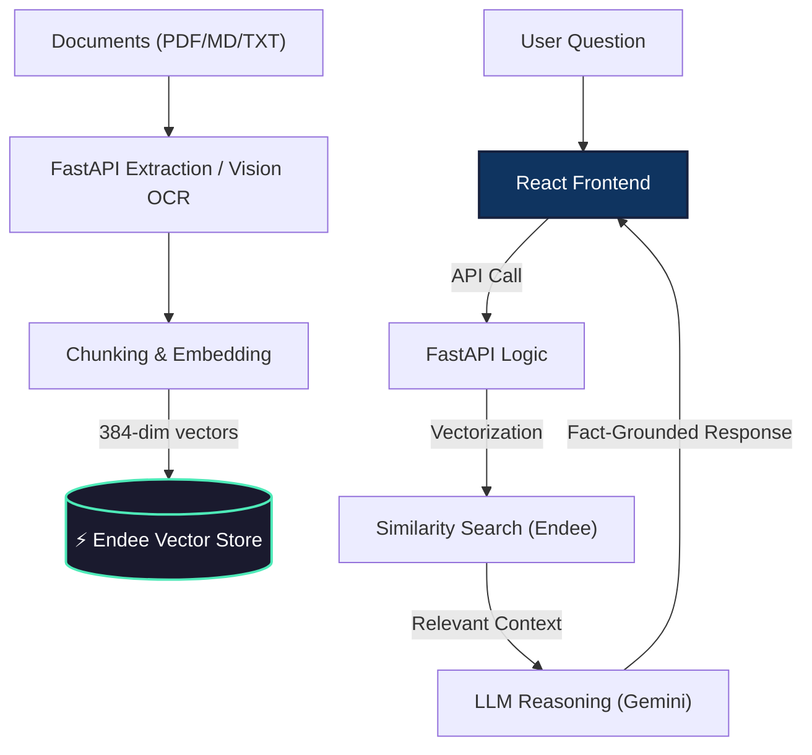

# ⚡ Curator AI | Neural Knowledge Engine

A high-performance, full-stack **Retrieval-Augmented Generation (RAG)** platform. This project combines a modern **React (Vite)** interface with a **FastAPI** reasoning engine, powered by the blazingly fast **Endee Vector Database** for long-term AI memory.

---

## Key Features

### 1. Multi-Chat Reasoning System
Manage multiple independent AI research sessions simultaneously. 
- **In Sidebar**: Switch between conversations, rename, or delete chats.
- **Persistent Memory**: Your chat history is saved locally in your browser so you never lose context.
- **Glassmorphism UI**: A premium, dark-mode design built with Tailwind CSS and smooth animations.

### 2. Intelligent Knowledge Vault
Upload, index, and query your private documents in seconds.
- **Neural Search**: Find information based on meaning, not just keywords, using `SentenceTransformers`.
- **Hybrid OCR**: Integrated **Gemini Vision** to read and extract text from handwritten notes, scanned PDFs, and images.
- **Document Management**: View all indexed files in the sidebar; delete individual documents or purge the entire index with one click.

### 3. Robust AI Infrastructure
- **Model Rotation**: Automatically fails over between `Gemini 2.5`, `Gemini 3.0`, and `Gemini 2.0` to bypass API outages or quota limits.
- **Exponential Backoff**: Built-in retry logic for handling transient Google AI Studio stability issues.
- **Endee-Powered**: Uses a high-performance C++ vector store for sub-millisecond similarity lookups.

---

## Tech Stack

| Layer | Technology |
|-------|------------|
| **Frontend** | React 18, Vite, Tailwind CSS, Heroicons |
| **Backend** | FastAPI, Pydantic, Uvicorn |
| **Vector DB** | **Endee** (Blazing fast local/remote vector store) |
| **LLM** | Google Gemini (1.5, 2.0, 2.5, 3.0 Flash/Pro) |
| **Embeddings** | `all-MiniLM-L6-v2` (Sentence-Transformers) |

---

## System Architecture



---

## Quick Start

### 1. Requirements
- Python 3.9+
- Node.js 18+
- Endee Server Running (on port 8080)

### 2. Backend Setup
```bash
cd backend
python -m venv venv && source venv/bin/activate
pip install -r requirements.txt
# Copy .env and add your GEMINI_API_KEY
uvicorn app:app --port 8000
```

### 3. Frontend Setup
```bash
cd frontend
npm install
# Set VITE_API_URL=http://localhost:8000 in .env
npm run dev
```

---

## Docker Deployment

The project is fully containerized. To launch the entire stack (DB + API + UI):

```bash
docker-compose up --build
```

---

## Project Structure

- `frontend/`: React application (modern UI components).
- `backend/`: FastAPI application (ML logic, Gemini integration).
- `docker-compose.yml`: Master orchestrator for production deployment.

---

*Modernizing AI Knowledge Management.*
