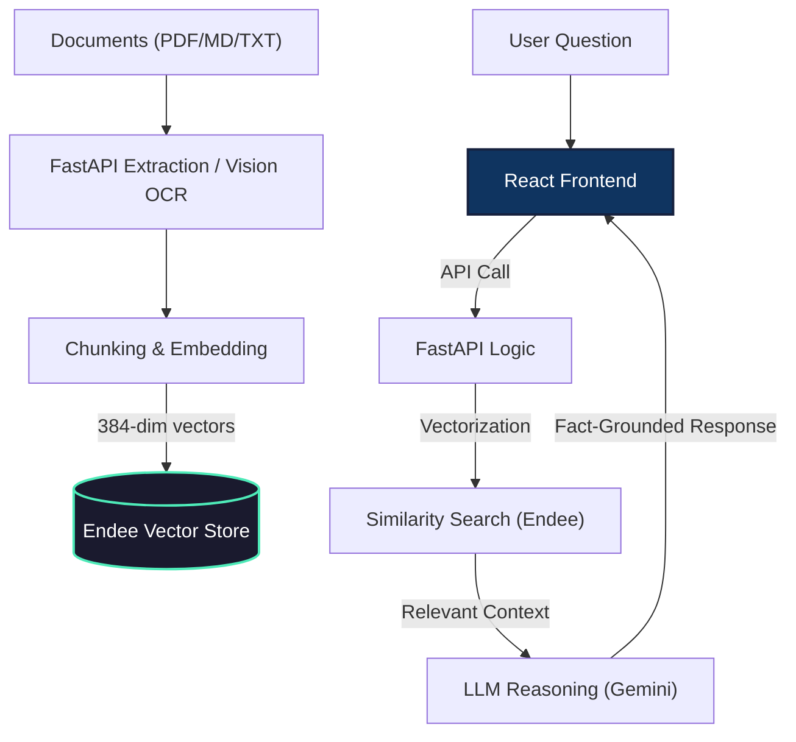

# Curator AI | Neural Knowledge Engine

A high-performance, full-stack **Retrieval-Augmented Generation (RAG)** platform. This project combines a modern **React (Vite)** interface with a **FastAPI** reasoning engine, powered by the blazingly fast **Endee Vector Database** for long-term AI memory.

---

## Key Features

### 1. Multi-Chat Reasoning System
Manage multiple independent AI research sessions simultaneously. 
- **In Sidebar**: Switch between conversations, rename, or delete chats.
- **Persistent Memory**: Your chat history is saved locally in your browser so you never lose context.
- **Glassmorphism UI**: A premium, dark-mode design built with Tailwind CSS and smooth animations.

### 2. Intelligent Knowledge Vault
Upload, index, and query your private documents in seconds.
- **Neural Search**: Find information based on meaning, not just keywords, using `SentenceTransformers`.
- **Hybrid OCR**: Integrated **Gemini Vision** to read and extract text from handwritten notes, scanned PDFs, and images.
- **Document Management**: View all indexed files in the sidebar; delete individual documents or purge the entire index with one click.

### 3. Robust AI Infrastructure
- **Model Rotation**: Automatically fails over between `Gemini 2.5`, `Gemini 3.0`, and `Gemini 2.0` to bypass API outages or quota limits.
- **Exponential Backoff**: Built-in retry logic for handling transient Google AI Studio stability issues.
- **Endee-Powered**: Uses a high-performance C++ vector store for sub-millisecond similarity lookups.
- **Resilient RAG Architecture**: Gracefully degrades to a direct LLM reasoning engine if the vector database becomes temporarily unavailable, ensuring uninterrupted chat functionality.

---

## Tech Stack

| Layer | Technology |
|-------|------------|
| **Frontend** | React 18, Vite, Tailwind CSS, Heroicons |
| **Backend** | FastAPI, Pydantic, Uvicorn |
| **Vector DB** | **Endee** (Blazing fast local/remote vector store) |
| **LLM** | Google Gemini (1.5, 2.0, 2.5, 3.0 Flash/Pro) |
| **Embeddings** | `all-MiniLM-L6-v2` (Sentence-Transformers) |

---

## System Architecture



---

## Quick Start

### 1. Requirements
- **Python 3.9+**
- **Node.js 18+**
- **Endee Server** (Optional for basic chat, required for RAG/Document QA)

### 2. Run Endee Vector DB (Optional)
Endee is required if you want to index and query your private documents. Run it in a background terminal process:
```bash
cd endee-oss
# Ensure binary has execute permissions
chmod +x build/ndd-neon-darwin 
# Run in background (keeps stdin open)
(NDD_DATA_DIR=./data ./build/ndd-neon-darwin &)
```

### 3. Backend Setup
The backend powers the LangChain logic and communicates with Gemini.
```bash
cd backend
python -m venv venv 
source venv/bin/activate # Use `venv\Scripts\activate` on Windows

pip install -r requirements.txt

# Create environment variables
echo "GEMINI_API_KEY=your_api_key_here" > .env
echo "NDD_URL=http://127.0.0.1:8080/api/v1" >> .env

# Start the FastAPI server
uvicorn app:app --port 8000 --reload
```

### 4. Frontend Setup
The modern React UI powered by Vite.
```bash
cd frontend
npm install

# Create environment variables
echo "VITE_API_URL=http://localhost:8000" > .env

# Start the dev server
npm run dev
```

---

## Docker Deployment

The project is fully containerized. To launch the entire stack (DB + API + UI):

```bash
docker-compose up --build
```

---

## Project Structure

```text
CuratorAI/
├── backend/                  # FastAPI Application
│   ├── app.py                # Main application entry point
│   ├── routes/               # API endpoint definitions (predict, files, health)
│   ├── services/             # Core ML logic, LLM integration, and Endee DB wrapper
│   └── models/               # Pydantic schemas for data validation
├── frontend/                 # React (Vite) Application
│   ├── src/                  # React source code
│   │   ├── components/       # Reusable UI components (Sidebar, Chat, etc.)
│   │   ├── services/         # API integration layer (Axios)
│   │   └── App.jsx           # Main React component
│   └── index.html            # Main HTML template
├── endee-oss/                # Endee Vector Database (C++)
│   ├── src/                  # Database engine source code
│   ├── build/                # Compiled binaries
│   └── run.sh                # Helper script to launch the DB
├── docker-compose.yml        # Master orchestrator for production deployment
└── README.md                 # Project documentation
```

---

*Modernizing AI Knowledge Management.*
